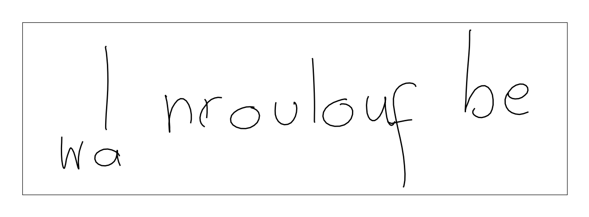
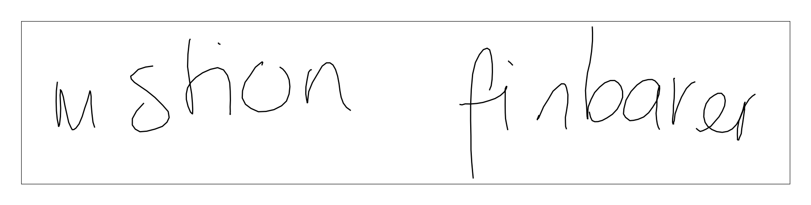

# Handwriting synthesis

* Implementation of models found in ["Generating Sequences With Recurrent Neural Networks"](https://arxiv.org/pdf/1308.0850.pdf) for handwriting synthesis

* All models are implemented using Tensorflow 2.0

## Training Models

* `python train.py -m [unconditional|conditional]`
* Optional arguments
  * `-e [NUM_EPOCHS]`
  * `-b [BATCH_SIZE]`
  * `-lr [LEARNING_RATE]`

## Generating samples

* `python main.py -m [unconditional|conditional]`
* Optional arguments
  * `-s [RANDOM_SEED]`
  * `-f [FILEPATH]` - path to save file
  * `-t [TEXT]` (for conditional generation only)

#### Unconditional generated handwriting samples:

